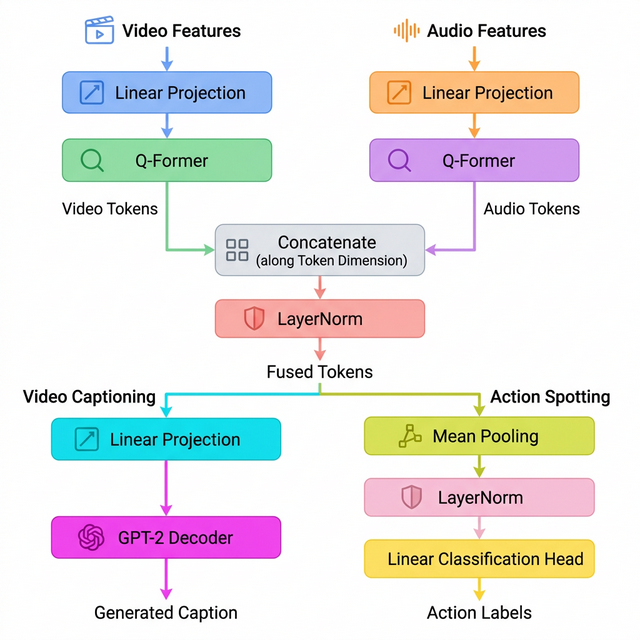

# SoccerNet Dual-Stream Qwen Dense Video Captioning

## Overview
A Dense Video Captioning and Action Spotting system for the SoccerNet dataset. This repository is a cleaned-up public version of my current dual-stream Qwen project and is intended as both an architectural exploration and a deployment-oriented presentation repo. The system reads pre-extracted visual and audio features, fuses them with a dual-stream Q-Former, and generates event captions with a Qwen2.5 decoder fine-tuned with LoRA.

## Core Innovation
The main architectural change is the evolution from an earlier GPT-2-based caption decoder to a **Dual-Stream Qwen** setup. Instead of relying on a single visual stream, the model processes visual and audio features through separate branches and fuses them before caption generation. This allows the system to align cues such as crowd reactions, whistles, and commentary-like audio signatures with broadcast visual context.

## Architecture



The visual stream uses pre-extracted soccer features, while the audio stream uses CLAP-style embeddings. Each modality is encoded separately, then fused through a dual Q-Former before being passed to the Qwen2.5 language model. The resulting representation is used for event-level dense caption generation.

## Key Features
- **Dual-Stream Fusion**: parallel visual and audio processing before late fusion.
- **Qwen2.5 Caption Decoder**: LoRA fine-tuning replaces the older GPT-2-style decoder.
- **SoccerNet-Compatible Pipeline**: keeps the project grounded in pre-extracted feature workflows rather than pretending to run directly on raw video.
- **Deployment Detail**: includes a minimal FastAPI inference route and Dockerfile for portable serving.

## From GPT-2 Baseline to Current Version
An earlier version of this line of work used a GPT-2-based caption decoder. The current version keeps the multimodal dual-stream idea, but upgrades the text generation backbone to Qwen2.5 with LoRA fine-tuning. In this public repo, GPT-2 is retained only as historical context; the main focus is the current Qwen-based system.

## Public Repo Boundaries
- This repo includes the codebase, inference wrapper, and deployment scaffold.
- This repo does **not** include model checkpoints.
- This repo does **not** accept raw video upload as input.
- Inference is performed from pre-extracted feature files stored outside the repository.

Checkpoints are intentionally not bundled because of file size and distribution constraints. To run real inference, set `CAPTION_CHECKPOINT_PATH` to a local checkpoint file.

## Path Configuration
This public repo is designed so users can plug in their own local paths instead of editing code. The main entry scripts now read dataset and checkpoint locations from environment variables or placeholder defaults.

Common variables:
- `SOCCERNET_PATH` or `SOCCERNET_VISION_ROOT`: visual feature root
- `AUDIO_ROOT` or `SOCCERNET_AUDIO_ROOT`: audio feature root
- `VISION_FEATURE_ROOT`: visual feature root for FastAPI serving
- `AUDIO_FEATURE_ROOT`: audio feature root for FastAPI serving
- `CAPTION_CHECKPOINT_PATH`: local caption checkpoint path
- `LLM_MODEL_PATH`: Hugging Face model id or local LLM path

You can start from:

```bash
cp env.example .env.local
```

and then export the values you need in your shell before running training or inference scripts.

## Suggested Local Layout
The repository itself does not bundle datasets or checkpoints. A typical local setup can look like this:

```text
workspace/
├── dual-stream-qwen-captioning/
│   ├── configs/
│   │   └── ds_a6000_bf16.json
│   ├── deployment/api.py
│   ├── tools/
│   │   └── run_audio_fix.sh
│   ├── dual_qformer.py
│   ├── dataset_dual.py
│   ├── run_train.sh
│   ├── run_test.sh
│   └── env.example
├── caption-2024/
│   └── <league>/<season>/<match>/
│       ├── 1_baidu_soccer_embeddings.npy
│       ├── 2_baidu_soccer_embeddings.npy
│       └── Labels-caption.json
└── SoccerNet-audio/
    └── <league>/<season>/<match>/
        ├── 1_audio_clap.npy
        ├── 2_audio_clap.npy
        ├── 1_audio.wav
        ├── 2_audio.wav
        └── 1_720p.mkv / 2_720p.mkv
```

Suggested path mapping:
- `SOCCERNET_PATH` or `SOCCERNET_VISION_ROOT` -> `caption-2024/`
- `AUDIO_ROOT` or `SOCCERNET_AUDIO_ROOT` -> `SoccerNet-audio/`
- `VISION_FEATURE_ROOT` -> `caption-2024/`
- `AUDIO_FEATURE_ROOT` -> `SoccerNet-audio/`

## Deployment-Oriented Detail
This repo includes a minimal serving interface:
- FastAPI app: `deployment/api.py`
- Docker setup: `Dockerfile`
- Serving dependencies: `requirements-deploy.txt`

The public API exposes:
- `GET /health`
- `POST /predict`

`POST /predict` expects:
- `match_id`
- `half`
- `timestamp_seconds`
- optional decoding controls such as `max_new_tokens`, `num_beams`, `temperature`, and `top_p`

The server then:
- resolves the relevant feature files from the configured data roots
- extracts a centered window around the requested timestamp
- runs the dual-stream captioning model
- returns a caption as JSON

## Running the API

Install serving dependencies:

```bash
pip install -r requirements-deploy.txt
```

Set required environment variables:

```bash
export VISION_FEATURE_ROOT=/path/to/caption-2024
export AUDIO_FEATURE_ROOT=/path/to/audio_features
export CAPTION_CHECKPOINT_PATH=/path/to/best_metric.pth.tar
export LLM_MODEL_PATH=Qwen/Qwen2.5-7B
```

Optional environment variables:

```bash
export VISION_FEATURE_FILE=baidu_soccer_embeddings.npy
export FRAMERATE=1
export WINDOW_SIZE_SECONDS=30
```

Run locally with `uvicorn`:

```bash
uvicorn deployment.api:app --host 0.0.0.0 --port 8000
```

Example request:

```bash
curl -X POST http://127.0.0.1:8000/predict \
  -H "Content-Type: application/json" \
  -d '{
    "match_id": "england_epl/2016-2017/Arsenal_Chelsea",
    "half": 1,
    "timestamp_seconds": 2712,
    "max_new_tokens": 32
  }'
```

Example response:

```json
{
  "match_id": "england_epl/2016-2017/Arsenal_Chelsea",
  "half": 1,
  "timestamp_seconds": 2712,
  "caption": "A dangerous attack develops on the right side of the pitch.",
  "device": "cuda",
  "video_shape": [30, 1024],
  "audio_shape": [30, 512]
}
```

## Docker
A lightweight `Dockerfile` is included for containerized serving:

```bash
docker build -t dual-stream-qwen-captioning .
docker run --rm -p 8000:8000 \
  -e VISION_FEATURE_ROOT=/data/caption-2024 \
  -e AUDIO_FEATURE_ROOT=/data/audio_features \
  -e CAPTION_CHECKPOINT_PATH=/weights/best_metric.pth.tar \
  dual-stream-qwen-captioning
```

Docker is documented as a portable deployment option, but if the current server cannot run Docker, the API can still be launched directly with `uvicorn`.

## Training
The full experimental codebase still includes scripts for classification, captioning, spotting, joint training, and RL fine-tuning. For this public repo, the most direct reproducible path is inference from pre-extracted features rather than retraining from scratch.

```bash
bash run_train.sh
```

## [Optional] Caption Visualization

You can render a short video clip with the model-generated captions overlaid at their predicted timestamps. Ground-truth labels are intentionally **not** shown — only the model's own captions appear.

### Step 1 — Install extra dependencies

```bash
pip install opencv-python pillow SoccerNet
```

### Step 2 — (First time) Download the match video

SoccerNet requires a registered account and a download password.

```bash
python visualize_captions.py \
  --download_only \
  --match_id   "england_epl/2016-2017/2017-05-06 - 17-00 Leicester 3 - 0 Watford" \
  --video_dir  /path/to/save/match_folder \
  --soccernet_password YOUR_PASSWORD
```

This downloads the 224p `.mkv` files for both halves (small file size, good for demos).

### Step 3 — Render a captioned clip

```bash
python visualize_captions.py \
  --pred_json  /path/to/results_dense_captioning.json \
  --video_dir  /path/to/match_folder \
  --half       1 \
  --start_min  30 \
  --end_min    35 \
  --output     caption_demo.mp4
```

| Argument | Description |
|---|---|
| `--pred_json` | JSON file produced by DVC inference (e.g. `models/<name>/outputs/test/.../results_dense_captioning.json`) |
| `--video_dir` | Folder containing the half video (`1_224p.mkv` / `2_224p.mkv`) |
| `--half` | 1 or 2 |
| `--start_min` / `--end_min` | Clip window in minutes |
| `--output` | Output `.mp4` path |

The script adds a compact black bar below the video frame and places the caption text there, centered and auto-wrapped. The bar height is kept proportional to the video so the caption is readable without covering the match footage.

## License
This repository is licensed under the MIT License; see the [LICENSE](LICENSE) file for details. The MIT license applies to the code in this repository only. External datasets and model weights, including SoccerNet and Qwen2.5, remain subject to their respective original licenses and usage terms.

## Acknowledgments
- Codebase direction was initially inspired by and extended from the SoccerNet dense captioning ecosystem, including the [sn-caption](https://github.com/SoccerNet/sn-caption) baseline.
- The Qwen2.5 language model backbone builds on the work of the [Qwen Team](https://github.com/QwenLM/Qwen2.5).
- We thank the SoccerNet team for organizing the challenge and providing the datasets, and the Baidu team for the pre-extracted visual features.

